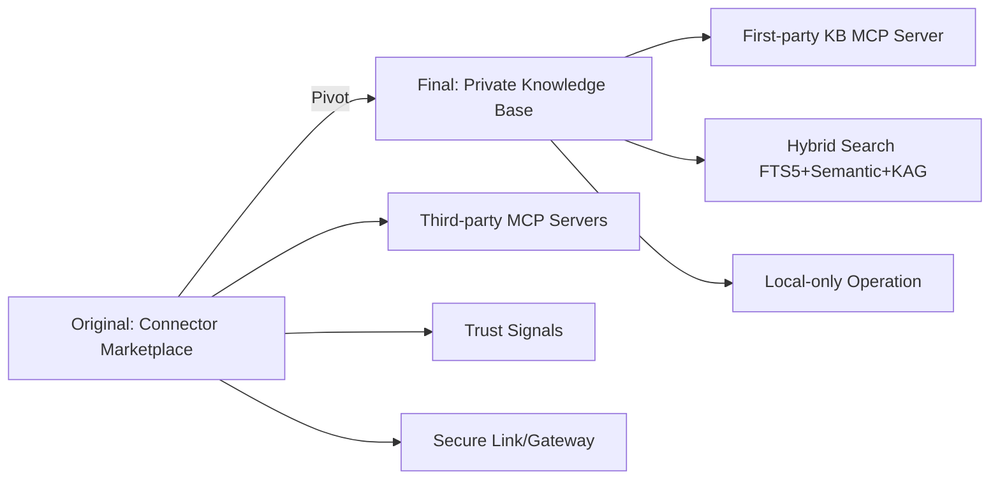
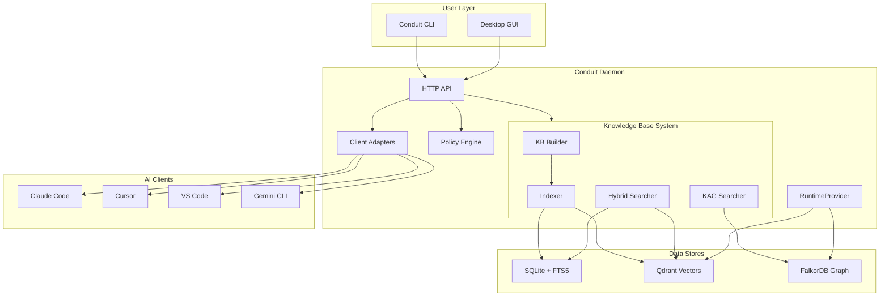
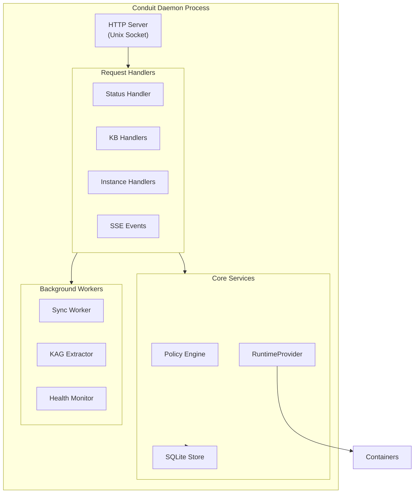
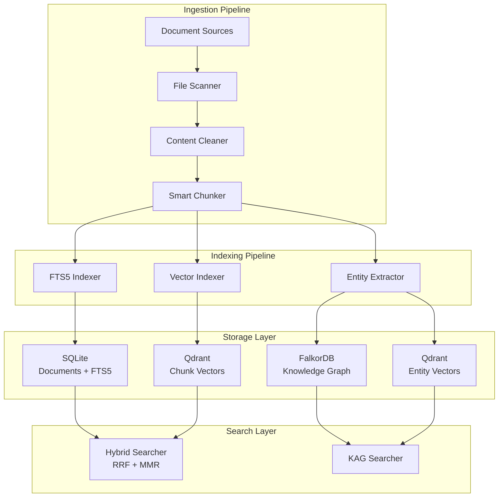
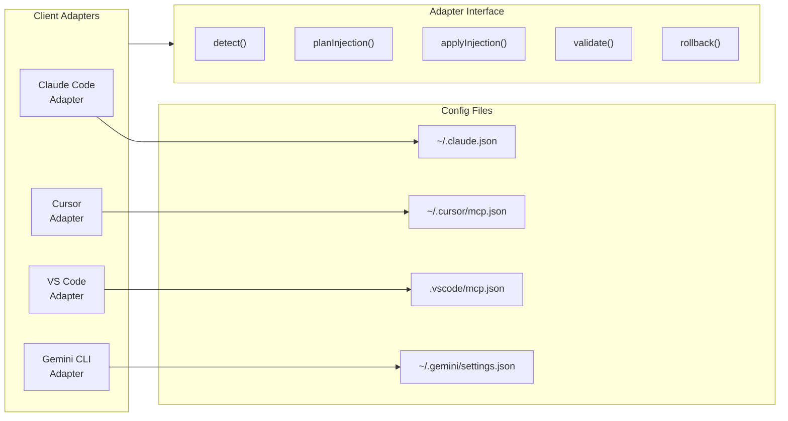
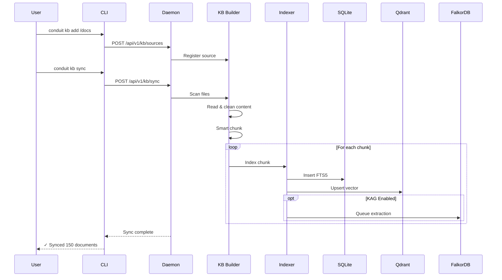
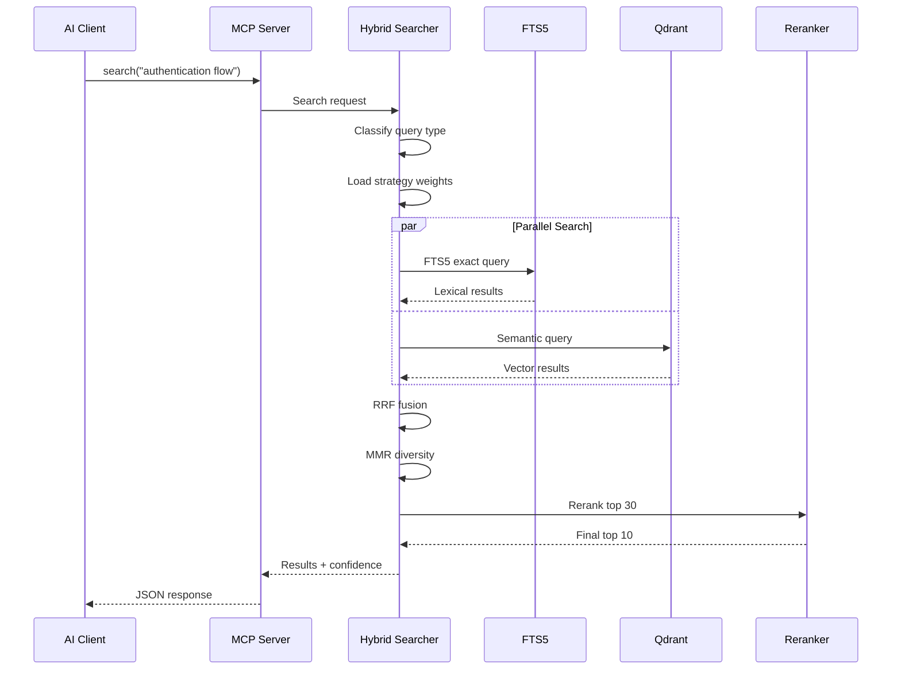
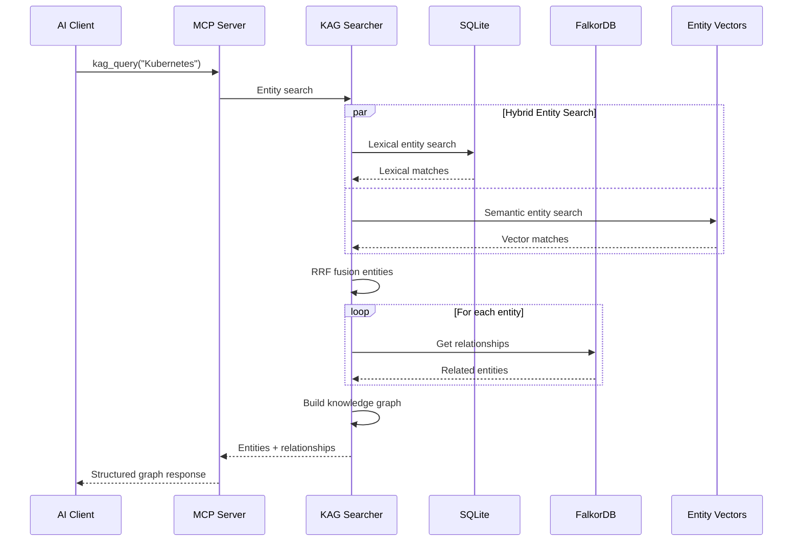

# Conduit Design Document

**Version**: 1.0.42
**Status**: Production
**Last Updated**: January 2026

**Read this document first** before diving into the detailed HLDs. It provides the narrative of how Conduit evolved from initial vision to production system.

---

## Table of Contents

1. [Executive Summary](#1-executive-summary)
2. [Original Vision](#2-original-vision)
3. [Design Evolution](#3-design-evolution)
4. [Final Architecture](#4-final-architecture)
5. [Key Design Decisions](#5-key-design-decisions)
6. [Systems Architecture](#6-systems-architecture)
7. [Data Flow](#7-data-flow)
8. [Lessons Learned](#8-lessons-learned)
9. [Future Direction](#9-future-direction)

---

## 1. Executive Summary

**What Conduit Is**: A private knowledge base that makes AI coding tools smarter by giving them access to your documents, code, and domain knowledge.

**Key Value Proposition**: Your documents stay local. Your AI tools get context. You maintain control.

**Technical Stack**:
- **Language**: Go (CLI/Daemon), TypeScript (Desktop GUI)
- **Search**: SQLite FTS5 + Qdrant (Semantic) + FalkorDB (Graph)
- **Integration**: MCP (Model Context Protocol) for AI tool connectivity
- **Runtime**: Container-based isolation (Podman/Docker)

---

## 2. Original Vision

### 2.1 Initial Goals (December 2025)

The original HLD envisioned Conduit as an **"AI Intelligence Hub"** with these components:

```
┌─────────────────────────────────────────────────────────────────────────┐
│                    ORIGINAL VISION: Connector Marketplace               │
├─────────────────────────────────────────────────────────────────────────┤
│                                                                         │
│  ┌─────────────────┐    ┌─────────────────┐    ┌─────────────────┐     │
│  │ Connector Store │───▶│   Auditor       │───▶│  Trust Signals  │     │
│  │ (Curated Index) │    │ (Security Scan) │    │ (Community+Audit)│     │
│  └─────────────────┘    └─────────────────┘    └─────────────────┘     │
│           │                                              │              │
│           ▼                                              ▼              │
│  ┌─────────────────────────────────────────────────────────────────┐   │
│  │              Third-Party MCP Servers (Sandboxed)                │   │
│  │  ┌──────────┐ ┌──────────┐ ┌──────────┐ ┌──────────┐           │   │
│  │  │ Notion   │ │ GitHub   │ │ Jira     │ │ Slack    │  ...      │   │
│  │  └──────────┘ └──────────┘ └──────────┘ └──────────┘           │   │
│  └─────────────────────────────────────────────────────────────────┘   │
│           │                                                             │
│           ▼                                                             │
│  ┌─────────────────────────────────────────────────────────────────┐   │
│  │                    AI Clients (Local + Remote)                   │   │
│  │  Claude Code │ Cursor │ VS Code │ ChatGPT (via Secure Link)     │   │
│  └─────────────────────────────────────────────────────────────────┘   │
│                                                                         │
└─────────────────────────────────────────────────────────────────────────┘
```

### 2.2 Planned Features by Version

| Version | Features |
|---------|----------|
| V0 | Daemon, CLI, RuntimeProvider, Connectors, KB, Client Adapters |
| V0.5 | Gateway, Secure Link (Tunnel), Trust Signals, Auth |
| V1 | Desktop GUI, Policy Engine, Consent Ledger, Auto-Updates |

### 2.3 Key Assumptions in Original HLD

1. Users want a **connector marketplace** with third-party MCP servers
2. **Trust signals** (community scores + audit) are critical for adoption
3. **Remote access** via Secure Link is needed for ChatGPT integration
4. **Secrets Manager** with OS keychain is essential for API key management

---

## 3. Design Evolution

### 3.1 The Pivot: From Marketplace to Private KB

During implementation, we discovered:

1. **Market Reality**: Users primarily wanted **private knowledge access**, not more connectors
2. **Third-Party Ecosystem**: MCP server ecosystem wasn't mature enough for marketplace
3. **Privacy Concerns**: Users valued local-only operation over remote access features
4. **Complexity Trade-off**: Building a marketplace was scope creep for V1

**The Pivot Decision** (January 2026):

> Focus Conduit V1 on being the **best private knowledge base for AI coding tools**, not a connector marketplace.



### 3.2 Major Learnings During Development

#### Learning 1: Search Quality is Everything

**Initial Approach**: Basic FTS5 keyword search
**Problem**: "How to authenticate users" didn't find "login implementation"

**Evolution**:
```
Phase 1: FTS5 Only           → Exact matches, no semantic understanding
Phase 2: + Qdrant Semantic   → Meaning captured, but exact phrases degraded
Phase 3: + Hybrid RRF        → Best of both worlds, but low recall
Phase 4: + MMR/Reranking     → Diversity + quality filtering
Phase 5: + KAG               → Entity-aware, multi-hop reasoning
```

**Final Architecture**: 13,500+ lines of KB code, most sophisticated component

#### Learning 2: Garbage In, Garbage Out (Multiplicatively)

```
Extraction (90%) × Chunking (90%) × Embedding (90%) × Retrieval (90%) = 65% end-to-end
```

**Key Insight**: Clean content BEFORE embedding, not after retrieval.

- Implemented `ContentCleaner` for boilerplate removal
- Smart chunking that respects code/markdown structure
- Pre-computed hashes on cleaned content

#### Learning 3: Match Architecture to Consumer

**Original Design**: LLM-in-the-loop retrieval with summarization

**Realization**: Conduit serves AI tools that will re-synthesize anyway.

```
Original: Query → Retrieval → LLM Summary → AI Client → LLM Processing
                              ↑ Redundant!

Final:    Query → Retrieval → Raw Chunks → AI Client → LLM Processing
                              ↑ Fast, precise, lets AI do reasoning
```

**Decision**: No LLM calls in hot path. Focus on precision and low latency.

#### Learning 4: Parallel Beats Replace

When adding KAG (knowledge graph), we didn't replace RAG:

```
┌─────────────────┐     ┌─────────────────┐
│   RAG Pipeline  │     │   KAG Pipeline  │
│   (FTS5+Qdrant) │     │   (FalkorDB)    │
└────────┬────────┘     └────────┬────────┘
         │                       │
         └───────────┬───────────┘
                     ▼
              AI Client Chooses
              Best Tool for Query
```

**Result**: RAG for text search, KAG for entity/relationship queries.

### 3.3 Features Deferred

| Feature | Reason Deferred |
|---------|-----------------|
| Secrets Manager | OS keychain adds complexity; users manage secrets externally |
| Secure Link | Local-first focus; target clients support local stdio |
| Trust Signals | No connector marketplace in V1 |
| Connector Store | Focus on first-party KB server |
| Full Auditor | Data model ready; execution logic deferred |

---

## 4. Final Architecture

### 4.1 High-Level Architecture



### 4.2 Component Summary

| Component | Purpose | Status |
|-----------|---------|--------|
| **Daemon** | Central orchestrator, HTTP API over Unix socket | Complete |
| **CLI** | User interface, thin client to daemon | Complete |
| **Desktop GUI** | Electron-based visual interface | Complete |
| **KB Builder** | Document ingestion, chunking, cleaning | Complete |
| **Hybrid Searcher** | FTS5 + Semantic + RRF fusion | Complete |
| **KAG Searcher** | Entity/relationship graph queries | Complete |
| **Policy Engine** | Permission evaluation, security enforcement | Complete |
| **Client Adapters** | Config injection for AI tools | Complete |
| **RuntimeProvider** | Container abstraction (Podman/Docker) | Complete |

---

## 5. Key Design Decisions

### 5.1 Local-First Architecture

**Decision**: All data stays local. No cloud sync. No telemetry.

**Rationale**:
- Privacy is non-negotiable for knowledge bases
- Developers distrust tools that phone home
- Simplifies architecture (no auth, no cloud infra)

**Trade-off**: No collaboration features in V1

### 5.2 CLI-Primary, GUI-Secondary

**Decision**: CLI is the primary interface; GUI is an optional cockpit.

**Rationale**:
- Developers prefer CLI for scripting and automation
- GUI is just a visual wrapper over CLI commands
- Easier to maintain one source of truth (daemon API)

**Implementation**:
```
GUI → IPC → CLI binary → Daemon API
     Never bypasses CLI
```

### 5.3 Container Isolation for Everything

**Decision**: All external processes run in containers.

**Rationale**:
- Security: Untrusted code can't access host
- Consistency: Same behavior across platforms
- Cleanup: Containers are ephemeral, easy to remove

**Implementation**:
- Qdrant: `conduit-qdrant` container
- FalkorDB: `conduit-falkordb` container
- Future connectors: All containerized

### 5.4 MCP for AI Tool Integration

**Decision**: Use MCP (Model Context Protocol) for AI client integration.

**Rationale**:
- Industry standard (Anthropic-defined)
- Supported by Claude Code, Cursor, VS Code, Gemini
- Clean tool interface (request → response)

**Implementation**:
```json
{
  "mcpServers": {
    "conduit-kb": {
      "command": "conduit",
      "args": ["mcp", "kb"]
    }
  }
}
```

### 5.5 Hybrid Search as Default

**Decision**: Default to hybrid search (FTS5 + Semantic + RRF).

**Rationale**:
- FTS5 excels at exact phrases and keywords
- Semantic search captures meaning
- RRF fusion combines strengths
- Query-adaptive weighting optimizes for query type

**Algorithm**:
```
Query → Classify (Exact/Entity/Conceptual/Factual/Exploratory)
      → Load strategy weights for query type
      → Parallel: FTS5 + Semantic search
      → RRF fusion with adaptive weights
      → MMR diversity filtering
      → Semantic reranking of top candidates
      → Return results with confidence metadata
```

---

## 6. Systems Architecture

### 6.1 Daemon Architecture



### 6.2 Knowledge Base Architecture



### 6.3 Client Adapter Architecture



---

## 7. Data Flow

### 7.1 Document Ingestion Flow



### 7.2 Search Flow



### 7.3 KAG Query Flow



---

## 8. Lessons Learned

### 8.1 Technical Lessons

| Lesson | Context | Outcome |
|--------|---------|---------|
| **Clean before embed** | Boilerplate polluted vector space | ContentCleaner applied pre-indexing |
| **Hybrid beats pure** | Neither FTS5 nor semantic alone was sufficient | RRF fusion of both |
| **Parallel over cascade** | Cascade search missed relevant results | Run all strategies, fuse with RRF |
| **Match arch to consumer** | LLM summarization redundant for AI clients | No LLM in hot path |
| **Parallel over replace** | KAG shouldn't replace RAG | Both available, client chooses |
| **Go regex limitations** | Lookahead caused panic | Manual parsing for complex patterns |
| **Vector cleanup order** | SQLite deleted before vectors | Delete vectors FIRST |

### 8.2 Product Lessons

| Lesson | Context | Outcome |
|--------|---------|---------|
| **Local-first wins** | Users value privacy over features | No cloud sync in V1 |
| **CLI-first for developers** | Developers prefer scripting | GUI is optional cockpit |
| **Focus beats features** | Marketplace was scope creep | Private KB focus in V1 |
| **Quality over quantity** | One great feature > many mediocre | 13.5k lines in KB system |

### 8.3 Process Lessons

| Lesson | Context | Outcome |
|--------|---------|---------|
| **Iterate with feedback** | Initial FTS5 wasn't enough | 17 phases of KB improvement |
| **Defer intelligently** | Not all HLD features needed for V1 | Secure Link, Trust Signals deferred |
| **Document decisions** | Easy to forget rationale | PROJECT_LEARNINGS.md created |

---

## 9. Future Direction

### 9.1 Short-term (V1.x)

- Complete consent ledger integration
- Improve error handling in GUI
- Add KB export/import functionality
- Enhanced diagnostics display

### 9.2 Medium-term (V1.5)

- Implement auditor execution logic
- Add secrets manager (OS keychain)
- Permission grant/revoke UI
- Multi-KB support

### 9.3 Long-term (V2)

- Secure Link/Gateway (when remote access needed)
- Connector marketplace (when ecosystem matures)
- Team collaboration features
- Enterprise admin controls

---

## Related Documents

| Document | Purpose |
|----------|---------|
| [HLD V0 — Core Engine](HLD-V0-Core-Engine.md) | Detailed architecture of core components |
| [HLD V0.5 — Secure Link](HLD-V0.5-Secure-Link.md) | Deferred remote access features |
| [HLD V1 — Desktop GUI](HLD-V1-Desktop-GUI.md) | GUI layer implementation |
| [Implementation Status](IMPLEMENTATION_STATUS.md) | Feature completion matrix |
| [PROJECT_LEARNINGS.md](../PROJECT_LEARNINGS.md) | Detailed development journey |
| [KB Search Architecture](../KB_SEARCH_HLD.md) | Search system deep dive |
| [KAG Architecture](../KAG_HLD.md) | Knowledge graph design |

---

*This document captures the evolution of Conduit from vision to production. It should be read first to understand the context behind the detailed HLD documents.*
