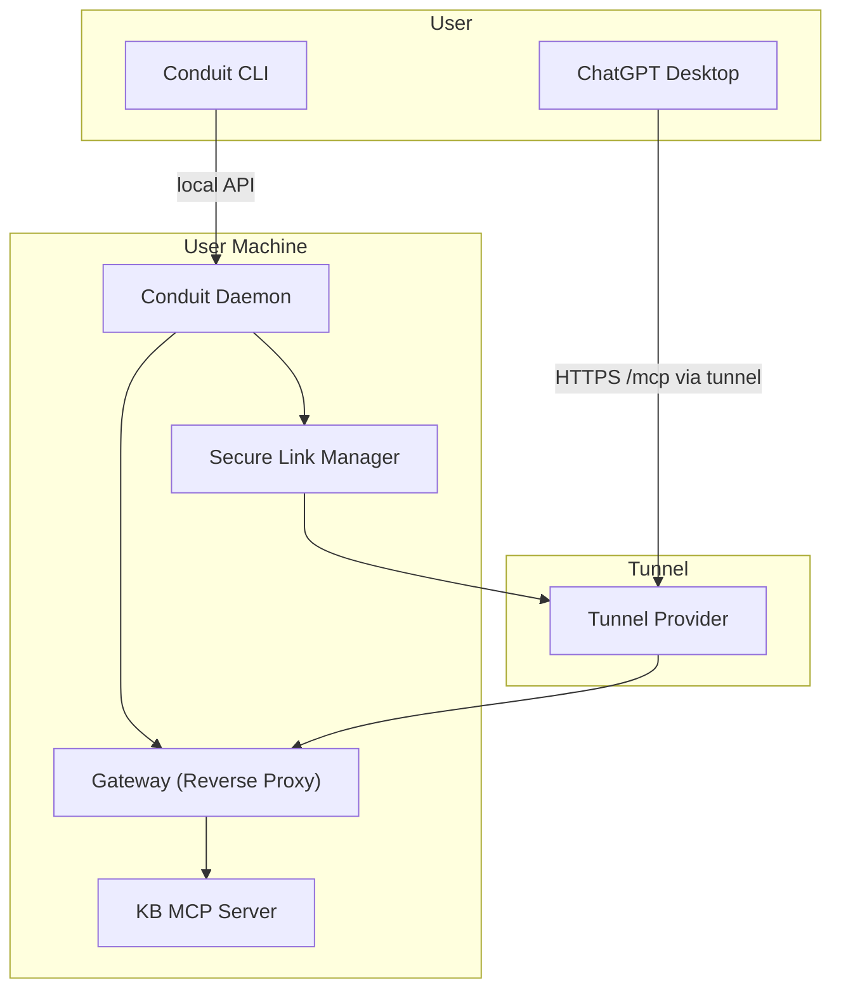

# High-Level Design V0.5 — Secure Link & Trust Signals

**Version**: 1.0.42 (Updated)
**Status**: PARTIALLY IMPLEMENTED / DEFERRED
**Last Updated**: January 2026

This document describes the V0.5 features as originally planned and their current implementation status.

---

## Executive Summary

V0.5 was designed to add:
1. **Secure Link** — Public HTTPS endpoint via tunnel for remote AI clients (ChatGPT)
2. **Gateway** — Single security choke point for all external access
3. **Trust Signals** — Community + Audit scoring for connectors

**Current Status**: Permission model foundations exist, but actual tunnel/gateway implementation is **deferred** to focus on the CLI-first private KB experience.

---

## 1. What V0.5 Was Designed to Add

### Original V0.5 Scope

| Feature | Purpose | Target Client |
|---------|---------|---------------|
| Secure Link | Public HTTPS /mcp endpoint | ChatGPT, remote clients |
| Gateway | Reverse proxy, auth, rate limiting | All remote access |
| Trust Signals | Community + audit scoring | Connector discovery |
| Auth System | Token-based authentication | Remote connections |

### What Remains the Same from V0

- Conduit Daemon as orchestrator
- RuntimeProvider abstraction
- ConnectorPackage/Instance model
- Client Adapters for local injection
- KB subsystem

---

## 2. Current Implementation Status

### 2.1 Gateway / Secure Link

**Status**: NOT IMPLEMENTED

| Component | Planned | Implemented |
|-----------|---------|-------------|
| Gateway reverse proxy | Local HTTPS termination | No |
| Tunnel provider | Cloudflare Tunnel / ngrok | No |
| Public URL generation | `https://xxx.tunnel.com/mcp` | No |
| Token authentication | Bearer token auth | No |
| Rate limiting | Request throttling | No |
| Revoke/rotate | One-click disable | No |

**What Exists**:
- Permission model includes `SecureLink` exposure flag
- Policy engine can evaluate secure link permissions
- Warning rule for public endpoint exposure

**Why Deferred**:
The V1 launch focus is **local-first private KB** for AI coding tools. Remote access via ChatGPT is a lower priority use case that introduces significant security surface area.

---

### 2.2 Trust Signals

**Status**: NOT IMPLEMENTED

| Component | Planned | Implemented |
|-----------|---------|-------------|
| Community signals | GitHub stars, forks, recency | No |
| Audit scoring | Security audit results | No |
| Trust store | Signal aggregation | No |
| UI display | Separate signals in store | No |

**Why Deferred**:
V1 focuses on first-party KB server rather than third-party connector marketplace. Trust signals become relevant when the connector store is active.

---

## 3. Original V0.5 Architecture (For Reference)



---

## 4. V0.5 Flow: Secure Link for ChatGPT (Deferred)

The originally planned flow was:

1. User runs: `conduit secure-link enable kb-default`
2. Daemon starts Gateway
3. Daemon generates auth token
4. Secure Link Manager creates tunnel
5. Conduit outputs public URL + token
6. User adds connector in ChatGPT
7. Validation confirms connectivity

**Revoke Path**: `conduit secure-link disable kb-default`

---

## 5. Security Considerations (For Future Implementation)

When implementing Secure Link:

### 5.1 Attack Surface

Remote ingress introduces new risks:
- Exposed gateway must handle untrusted traffic
- Token compromise allows KB access
- Rate limiting is critical to prevent abuse

### 5.2 Required Controls

| Control | Purpose |
|---------|---------|
| Token auth | Authenticate all requests |
| Rate limiting | Prevent abuse/DoS |
| Request logging | Audit trail |
| One-click revoke | Immediate disable |
| Exposure timeout | Auto-disable after N hours |
| TLS termination | Encrypt tunnel traffic |

### 5.3 Privacy Stance

- User documents remain local
- Secure Link is a controlled doorway
- Explicit consent required for exposure
- Clear indication of what's accessible

---

## 6. Permission Model (Implemented)

The policy engine supports secure link permissions:

**Location**: `internal/policy/types.go`

```go
type ExposurePerms struct {
    SecureLink bool // Allowed to expose via secure link
}
```

**Policy Rule**: `warn_secure_link`
- Warns when connector requests public endpoint exposure
- User must explicitly approve

---

## 7. Implementation Roadmap

### Phase 1: Foundation (Completed)

- [x] Permission model for SecureLink
- [x] Policy engine support
- [x] Warning rules

### Phase 2: Gateway (Future)

- [ ] Local reverse proxy implementation
- [ ] Token authentication
- [ ] Rate limiting
- [ ] Request logging

### Phase 3: Tunnel (Future)

- [ ] Tunnel provider integration (Cloudflare/ngrok)
- [ ] Public URL generation
- [ ] Certificate management
- [ ] Revoke/rotate functionality

### Phase 4: Trust Signals (Future)

- [ ] Community signal ingestion
- [ ] Audit result storage
- [ ] Trust score calculation
- [ ] UI integration

---

## 8. Alternative: Local-Only MCP

For V1, Conduit focuses on **local MCP** which doesn't require Secure Link:

| Client | Transport | Secure Link Needed? |
|--------|-----------|---------------------|
| Claude Code | stdio | No |
| Cursor | stdio | No |
| VS Code | stdio | No |
| Gemini CLI | stdio | No |
| ChatGPT Desktop | HTTPS | **Yes** |

Since the V1 target clients all support local stdio transport, Secure Link is not required for the initial launch.

---

## 9. When to Implement Secure Link

Consider implementing when:
1. ChatGPT or other remote-only clients become priority
2. Team/collaboration features require shared KB access
3. Mobile AI clients need KB access

---

## 10. Version History

| Version | Date | Changes |
|---------|------|---------|
| Original | Dec 2025 | Initial V0.5 HLD |
| Updated | Jan 2026 | Documented deferred status, current implementation |

---

## See Also

- [HLD V0 — Core Engine](HLD-V0-Core-Engine.md)
- [HLD V1 — Desktop GUI](HLD-V1-Desktop-GUI.md)
- [Implementation Status](IMPLEMENTATION_STATUS.md)
